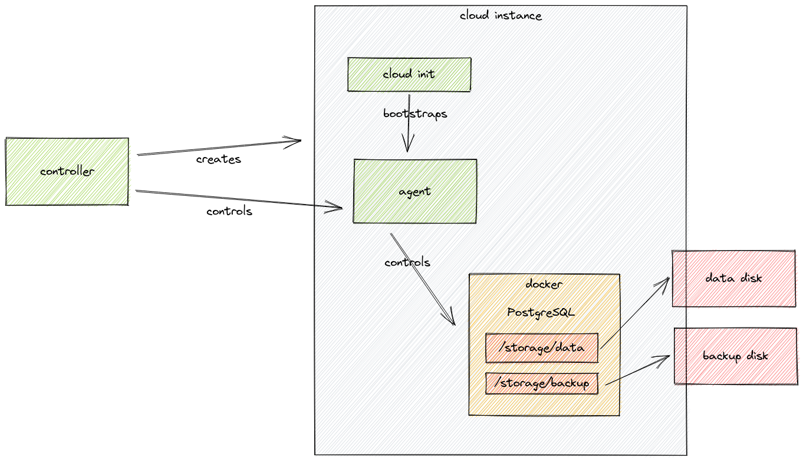

# Solidblocks RDS

This repository contains a prototype of a AWS-like RDS service intended for local and cloud hosting environments where a RDS like service is not available.

## Potential Features 

* Backup
  * to local disk
  * to S3 compatible service
  * PITR recovery
* Databases
  * PostgreSQL
  * MySQL/MariaDB
* Multi node clusters
* Environment support
  * Hetzner Cloud
  * VMWare
  * generic cloud-init
* Monitoring
  * Grafana
  * Splunk
    * Kibana
* Encrypt at rest

## Feature set for initial spike

* Hetzner cloud as target environment
* PostgreSQL as database
* Single node setup for DB
* Backup to locally attached disk
* Prefer simpler architecture and short time-to-recover over complicated/complex multi node clusters that run without interruptions

## Architecture

* agent can run without the controller attached
* communication between controller and agent is secured via mutual TLS
* controller -> provider -> instance -> configuration
* no non-db state
* apply/ensure/diff
* control loops
* manager vs repository
* eventual everything
* 

### Stuff
* infrastructure methods diverge the running state towards a desired model. they must not depend on any special pre-existing state of the infrastructure and be able to be called multiple times (idempotent)
* stuff will break or not respond as expected. infrastructure methods must verify the result of their actions and return if the run was successful or not, the caller can and will run a retry.
* all config values are versioned
* check for duplicate api keys
* verify delete
  * check for resources
* data model madness